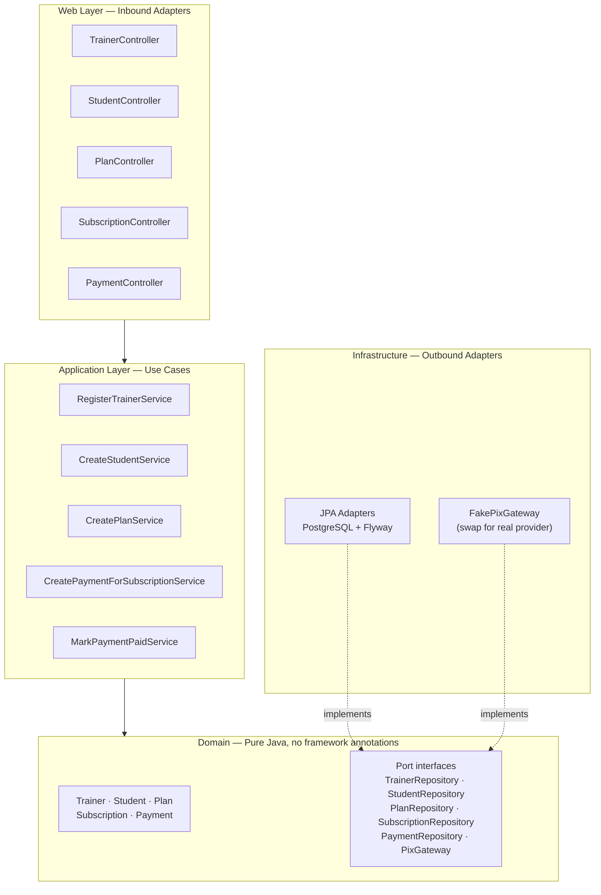
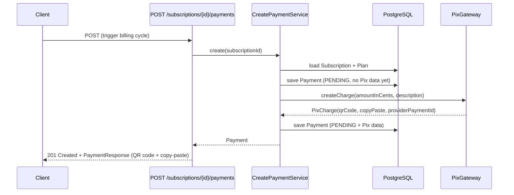

# pix-subscriptions

A Spring Boot backend for Pix-based recurring billing. Trainers define plans, enroll students into subscriptions, and trigger monthly Pix charges that students pay via QR code or copy-paste. Each billing cycle produces a Payment record with the Pix QR code and copy-paste string ready to send to the student.

Built to explore a realistic payment domain in Java — not a toy CRUD app, but a system where correctness matters: duplicate charges are bad, partial writes are bad, and the domain model has to enforce its own invariants.

## Architecture

The backend follows a hexagonal (ports and adapters) architecture. The domain model has zero Spring or JPA annotations. Application services coordinate the use cases. Inbound and outbound adapters (REST controllers, JPA repositories, the Pix gateway) live in the infrastructure layer and depend inward — never the other way around.



Domain objects are immutable. State transitions return new instances:

```java
Payment paid = payment.markPaid(Instant.now());
Subscription cancelled = subscription.cancel();
```

JPA entities and domain classes are separate: the infrastructure maps between them so the domain never leaks persistence concerns.

## Payment flow



The client sends the QR code or copy-paste string to the student via the channel of their choice (WhatsApp, email). When payment is confirmed, `POST /payments/{id}/mark-paid` transitions the payment to `PAID`.

## Domain model

| Entity | Key fields |
|--------|-----------|
| `Trainer` | email, passwordHash, name, pixKey |
| `Student` | trainerId, name, contactInfo, status (`ACTIVE`/`PAUSED`) |
| `Plan` | trainerId, name, amountInCents, intervalDays |
| `Subscription` | studentId, planId, status (`ACTIVE`/`CANCELLED`), nextPaymentDate |
| `Payment` | subscriptionId, amountInCents, dueDate, status (`PENDING`/`PAID`/`CANCELLED`), pixQrCode, pixCopyPaste |

Subscriptions track `nextPaymentDate` so a future scheduler knows which ones to charge without scanning every row.

## API

All endpoints except `/api/auth/login`, `/api/trainers/register`, and `/api/webhooks/**` require a `Bearer` token in the `Authorization` header.

| Method | Path | What it does |
|--------|------|-------------|
| `POST` | `/api/auth/login` | Login, returns a JWT |
| `POST` | `/api/trainers/register` | Register a new trainer |
| `POST` | `/api/trainers/{id}/students` | Enroll a student |
| `GET`  | `/api/trainers/{id}/students` | List trainer's students (paginated) |
| `POST` | `/api/trainers/{id}/plans` | Create a billing plan |
| `GET`  | `/api/trainers/{id}/plans` | List trainer's plans (paginated) |
| `POST` | `/api/students/{id}/subscriptions` | Subscribe a student to a plan |
| `GET`  | `/api/students/{id}/subscriptions` | List student's subscriptions (paginated) |
| `POST` | `/api/subscriptions/{id}/payments` | Trigger a Pix charge for a billing cycle |
| `GET`  | `/api/subscriptions/{id}/payments` | List payments for a subscription (paginated) |
| `POST` | `/api/payments/{id}/mark-paid` | Mark a payment as paid (webhook or manual) |

List endpoints accept `?page=0&size=20` query params and return `{ content, totalElements, totalPages, page, size }`.

## Running locally

Requires Docker for PostgreSQL.

```bash
# Start Postgres
docker run -d \
  --name pix-sub-db \
  -e POSTGRES_DB=pixsub \
  -e POSTGRES_USER=pixsub \
  -e POSTGRES_PASSWORD=pixsub \
  -p 5432:5432 \
  postgres:16

# Run the app
cd backend
./gradlew bootRun
```

Flyway runs migrations automatically on startup. The app listens on `http://localhost:8080`.

## Testing

Integration tests use Testcontainers — no manual Postgres setup needed:

```bash
cd backend
./gradlew test
```

Tests spin up a real Postgres container, run migrations, and hit the full stack from the service layer down. No mocks of the persistence layer.

## What's next

- [x] Scheduler: auto-triggers payments at 08:00 daily when `nextPaymentDate` is reached
- [x] Pagination on all list endpoints
- [x] JWT authentication
- [x] EfiBank `PixGateway` adapter — activate with `pixsub.pix.provider=efibank` + credentials
- [x] Webhook receiver — `POST /api/webhooks/pix/efibank` (EfiBank format) and `POST /api/webhooks/pix` (generic)

## Tech

Java 21 · Spring Boot 3 · PostgreSQL · Flyway · Testcontainers · JUnit 5 · Gradle
